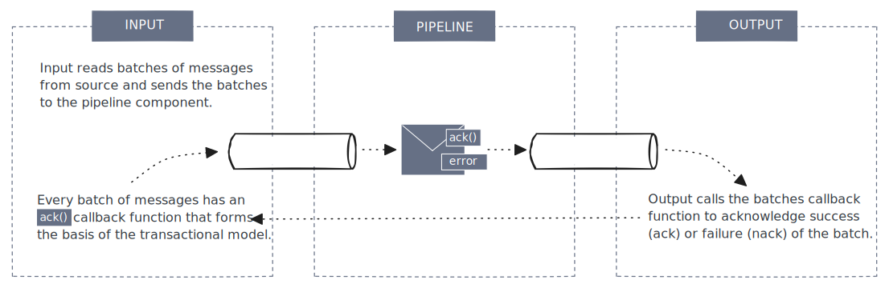

= Message Delivery Semantics
:description: Learn about Redpanda Connect's transactional model and error handling

Redpanda Connect (RPCN) guarantees strong message delivery semantics across its data pipelines by leveraging a transactional model centered around message batch acknowledgment. This ensures reliable, scalable, and predictable data movement between input and output systems, with particular support for *at-least-once delivery* — without requiring intermediate message persistence.

This page outlines how Redpanda Connect manages message delivery across the Input → Pipeline → Output architecture.

== Delivery Guarantees

Associated with every batch of messages is an `ack()` function. It's a callback function provided by the input and its the outputs job to call the `ack()` function to inform the input of the success ("ack") or failure (negative ack or "nack") of the batch. The input can then decide what to do, e.g. auto-retry nacks, propagate the nack upstream to input connectors that support it (Google PubSub), or drop the batch. When connecting to *at-least-once* inputs and outputs, Redpanda Connect is able to guarantee *at-least-once* delivery without needing to persist messages during transit.

Key Benefits:

* Messages will not be lost unless explicitly dropped in configuration
* Ensures every message is processed at-least-once, with optional retry logic for failures
* Duplicates may occur in failure recovery scenarios — typical of at-least-once systems
* Delivery status is communicated back to the input, enabling robust retry and propagation strategies
* No need for disk-based check-pointing — reducing latency and infrastructure complexity

== Caveats to At-Least-Once

At-least-once delivery in a Redpanda Connect pipeline means every message will be delivered at-least-once even if failures occur (which might result in some duplicates, but no data is lost). Introducing a distributed or externally persisted state into a pipeline can compromise this guarantee. The pipeline's built-in fault tolerance assumes that if an output fails, the message will be retried or reprocessed upon recovery. However, an external state (such as a remote cache or database used within the pipeline) may not reset on failure. It could retain an indication that a message was processed even if that message was never successfully processed by the output, and this mismatch can lead to message loss during recovery.

For example, imagine a pipeline uses a distributed cache to keep track of message IDs that have been seen in order to filter out duplicates. When a new message arrives, its ID is added to the cache immediately to mark it as processed. Now suppose the pipeline's output connector fails or the pipeline instance crashes just after updating the cache, but before the message actually reaches the destination. When the system comes back up, it will retry processing any unacknowledged messages, but because the cache still contains that message ID from the earlier attempt, the pipeline treats the message as a duplicate and drops it. As a result, that message is never delivered by the output at all — a direct violation of at-least-once guarantees.

One way to mitigate this risk is to avoid using state that outlives the pipeline process. For instance, keeping the cache in-memory (local to each pipeline instance) means it won't preserve entries through a crash. If the process restarts, an in-memory cache would start fresh, allowing the system to reprocess any message that didn't complete earlier instead of mistakenly skipping it. If you combine this with consistent partitioning of messages by key across horizontally scaled pipeline instances (so that each key is always handled by the same instance), you can still perform de-duplication within each partition while keeping state isolated per instance. In this setup, a failure that restarts one instance will clear that instance's cache, and upon recovery it will reprocess its pending messages without interference from stale state.

Even with such mitigations, if reliable delivery is paramount, a safer approach is to avoid relying on any external persistent state for eliminating duplicates within the pipeline. Instead, let the pipeline run with its native at-least-once behavior (allowing potential duplicates on retries) and design the downstream systems to handle duplicates idempotently.

== Error Handling

Redpanda Connect embraces a declarative and opt-in error-handling strategy:

* A message error is represented as a flag — not a dropped message
* If not explicitly handled in the pipeline, errored messages flow through to the output stage
* Error-handling components (e.g. `try`, `catch`) allow users to:
** Retry failed operations
** Route errors to dead-letter queues
** Fallback to alternate logic or output targets

This model provides flexibility in building resilient pipelines without introducing unnecessary complexity. Refer to the specific https://docs.redpanda.com/redpanda-connect/configuration/error_handling/[Error Handling] documentation for further details and examples.